# Feature Flag Platform

[](https://github.com/manishjangid1499-cell/featureflag/actions/workflows/ci.yml)


A full-stack **feature flag management and runtime evaluation platform** built with Java 21, Spring Boot microservices, React, Kafka, Redis, MySQL, and Docker.

> **Live Demo:** https://featureflag-mj.duckdns.org

The platform separates the **control plane** used by people who manage feature flags from the **runtime evaluation plane** used by applications. Teams can manage environment-specific flags, schedule releases, target individual subjects, perform deterministic percentage rollouts, issue SDK credentials, inspect audit history and analytics, and deliver operational notifications without coupling feature releases to application deployments.

The project focuses on practical backend and distributed-systems concerns: **security boundaries, reliable event publication, idempotent consumers, caching and fallback, optimistic concurrency, observability, failure recovery, and infrastructure-level testing**.

<p align="center">
  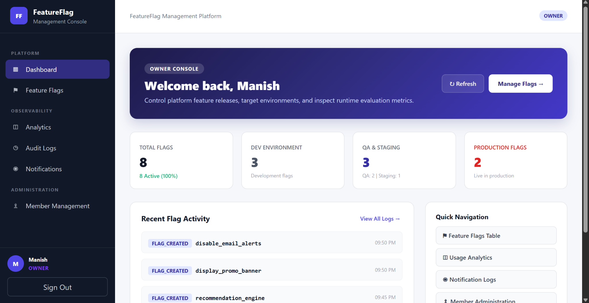
</p>

---

## Highlights

- Environment-aware feature flags for `DEV`, `QA`, `STAGING`, and `PROD`
- Enable/disable controls, schedules, subject targeting, and deterministic rollout percentages
- Separate SDK-key-authenticated runtime evaluation API
- Java SDK implemented without a Spring runtime dependency
- RSA/RS256 JWT authentication with backend-enforced RBAC
- Invitation-based member onboarding and role administration
- Redis cache-aside configuration caching with MySQL fallback
- Transactional outbox for durable lifecycle and notification events
- Kafka consumers with persisted event-id idempotency, retry/backoff, and DLT handling
- Atomic MySQL analytics aggregation
- Durable notification processing with leases, claim tokens, and retry scheduling
- Optimistic locking for concurrent member and flag changes
- Flyway-owned database migrations
- Spring `ProblemDetail` error contracts with correlation IDs
- Actuator, Micrometer, and Prometheus-compatible metrics
- Docker Compose environment and disposable Testcontainers integration suites
- GitHub Actions CI for backend, infrastructure profiles, frontend, and SDK

---

## Technology Stack

| Area | Technologies |
|---|---|
| Backend | Java 21, Spring Boot 3.5.16, Spring Data JPA, Hibernate |
| Microservices | Spring Cloud 2025.0.3, Spring Cloud Gateway, Eureka, OpenFeign |
| Security | Spring Security, RSA/RS256 JWT, BCrypt, RBAC |
| Persistence | MySQL 8.4, Flyway |
| Messaging | Apache Kafka 4.3.1 |
| Caching | Redis 8.10.0, Lettuce |
| Frontend | React 19, TypeScript 6, Vite 8, Axios |
| SDK | Java 21, JDK `HttpClient`, Jackson |
| Infrastructure | Docker, Docker Compose, Nginx |
| Testing | JUnit, Mockito, Testcontainers, H2 where appropriate |
| Observability | Spring Boot Actuator, Micrometer, Prometheus-compatible metrics |
| CI | GitHub Actions |

---

## Architecture Overview

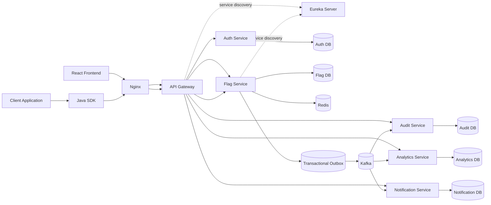

The system intentionally separates management concerns from runtime evaluation. Each stateful business service owns its own schema and database-scoped user. The local Docker Compose environment hosts those schemas in one MySQL server for convenience; the services do not share repositories or persistence ownership.

### Control Plane

Human users interact with the React management console through Nginx and the API Gateway.

```text
Browser
  -> Nginx
  -> API Gateway
  -> Auth / Flag / Audit / Analytics / Notification
```

Login is handled by Auth Service. Protected requests use a bearer JWT, while authorization is enforced by each backend service rather than trusted to the browser or gateway.

The control plane provides:

- authentication and profile access
- member and role administration
- invitation management
- feature flag CRUD and lifecycle operations
- SDK-key administration
- audit history
- analytics queries
- notification history

There is no public self-registration flow.

### Runtime Evaluation Plane

Applications evaluate flags independently of human-user authentication.

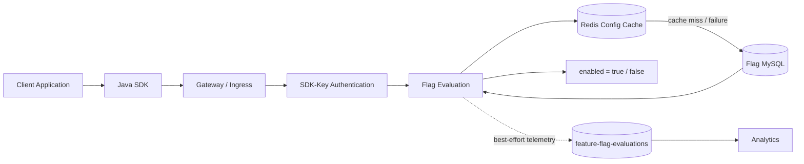

Runtime evaluation uses:

```http
GET /runtime/v1/flags/{flagKey}/evaluate?subject={subject}
X-Feature-Flag-Key: <sdk-key>
```

The SDK key determines the environment and grants runtime evaluation access only. It does not grant feature-management privileges.

### Event-Driven Lifecycle

Feature lifecycle changes use a transactional outbox.

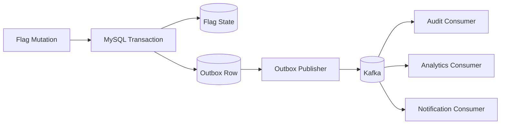

The flag mutation and outbox row commit in the same database transaction. Publishing happens after commit. Delivery is therefore **at least once**, not distributed exactly once. Consumers persist event IDs and apply effects transactionally so duplicate Kafka delivery does not duplicate database effects.

---


## Cloud Deployment

A live deployment of the platform is hosted on an AWS EC2 Ubuntu server and runs the complete application stack with Docker Compose.

**Live application:** https://featureflag-mj.duckdns.org

For the complete deployment and operations guide, see [docs/DEPLOYMENT.md](docs/DEPLOYMENT.md).

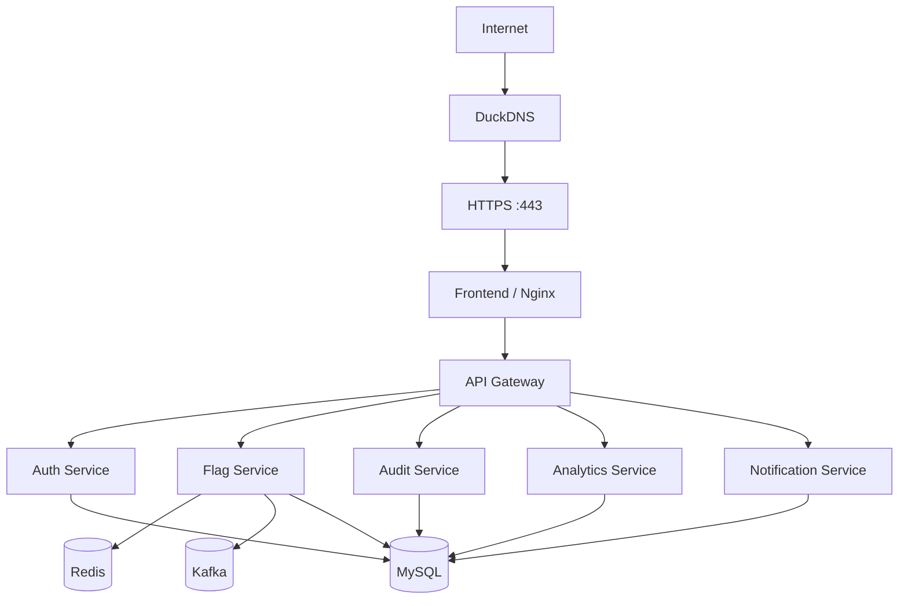

The deployment uses:

- AWS EC2 with Ubuntu 24.04 LTS
- Docker Engine and Docker Compose
- Nginx as the public frontend and same-origin API ingress
- DuckDNS for hostname resolution and dynamic IP updates
- Let's Encrypt certificates managed by Certbot
- automatic certificate renewal
- automatic DuckDNS IP synchronization through a systemd timer
- persistent Docker volumes for MySQL and Kafka
- container health checks and restart policies

Only the public web entry points are exposed externally. HTTP and HTTPS are available on ports `80` and `443`; backend application services, MySQL, Redis, and Eureka remain internal to the Docker network. Kafka's external listener is bound to loopback rather than the public interface.

The production environment keeps database credentials, JWT signing keys, internal service credentials, SMTP credentials, and TLS private keys outside Git.

> The live portfolio environment may occasionally be offline when the EC2 instance is intentionally stopped.

---

## Application Preview

### Feature Flag Management

<p align="center">
  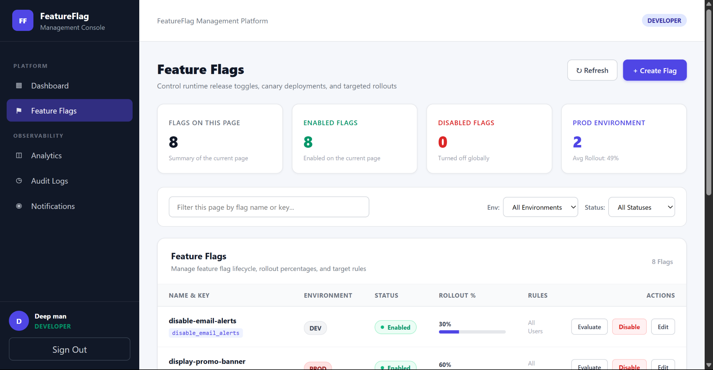
</p>

The control plane supports environment-specific flag lifecycle management, filtering, rollout percentages, targeting rules, and runtime evaluation actions.

### Create and Configure a Flag

<p align="center">
  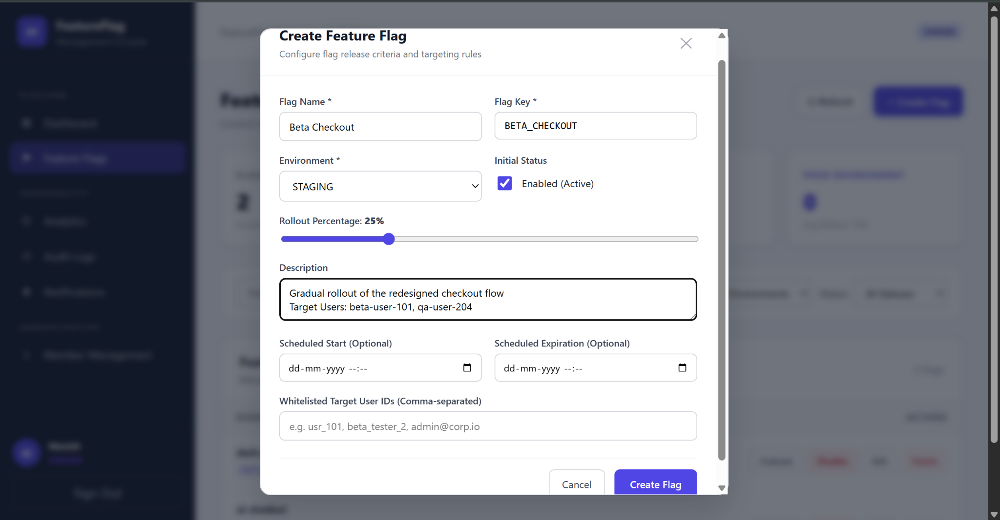
</p>

Flag creation supports environment selection, initial state, rollout percentage, optional schedules, descriptions, and targeted subject IDs.

### Member and Role Administration

<p align="center">
  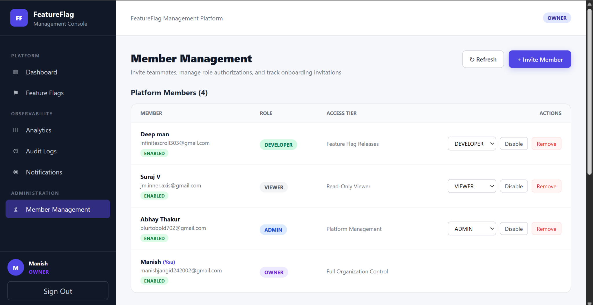
</p>

The platform uses `OWNER`, `ADMIN`, `DEVELOPER`, and `VIEWER` roles with backend-enforced authorization boundaries.

### Invitation Workflow

<p align="center">
  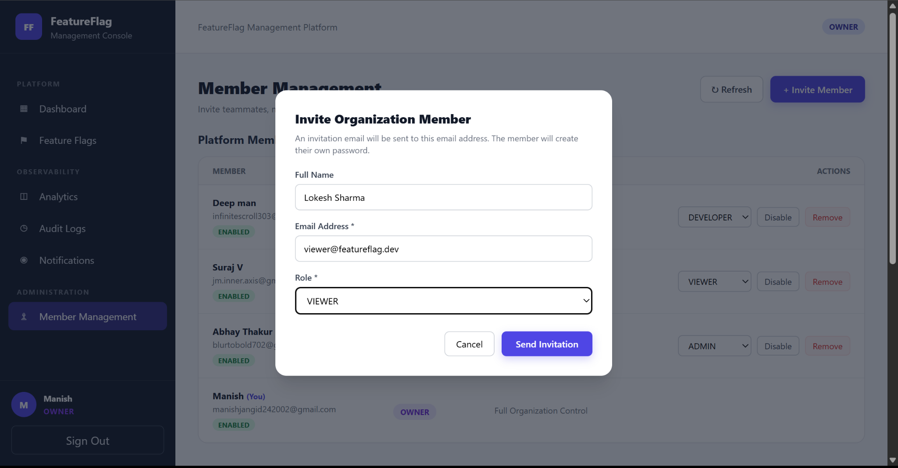
</p>

Invitations allow administrators to onboard members without creating passwords on their behalf. Invitees choose their password after accepting the invitation.

### Analytics

<p align="center">
  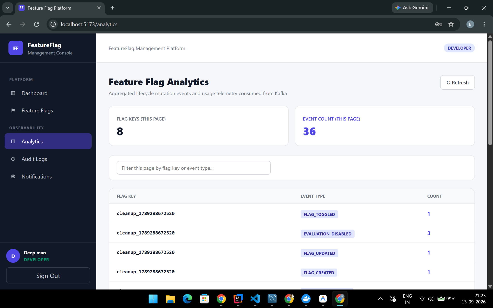
</p>

Analytics aggregates lifecycle mutations and runtime evaluation telemetry consumed from Kafka.

### Audit Logs

<p align="center">
  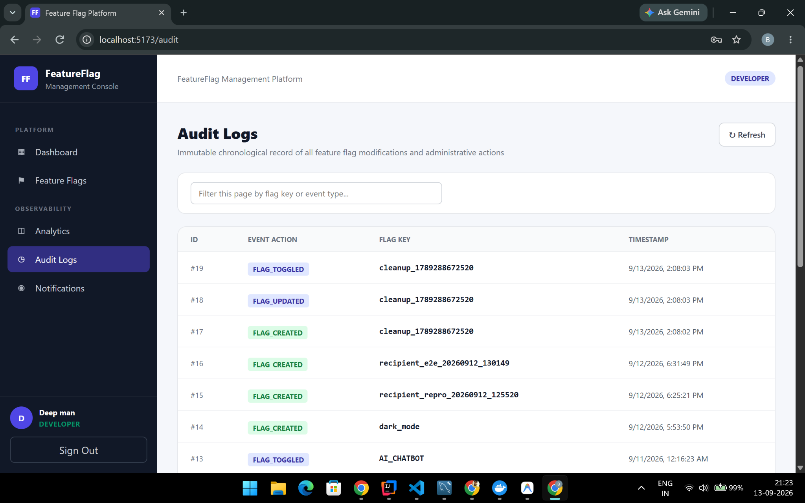
</p>

Audit records provide a chronological history of feature-flag lifecycle activity.

### Notifications

<p align="center">
  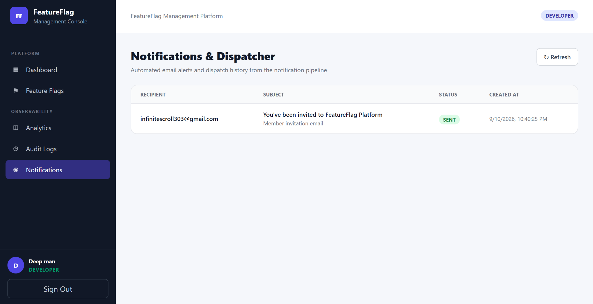
</p>

Notification history exposes durable delivery state for invitation and lifecycle email processing.

---

## Services

The Java modules are independent Maven projects rather than one root Maven reactor.

| Component | Directory | Local Port | Responsibility |
|---|---|---:|---|
| Frontend / Nginx | `Frontend/feature-flag-ui` | `5173` in Vite / `3000` via Compose | Browser UI, static assets, same-origin ingress |
| API Gateway | `api-gateway/api-gateway` | `8080` | Gateway routing and Eureka-based discovery |
| Auth Service | `auth-service/auth-service` | `8081` | Login, JWT issuance, members, invitations, recipient lookup |
| Flag Service | `flag-service/flag-service` | `8082` | Flag management, evaluation, SDK credentials, outbox |
| Audit Service | `audit-service/audit-service` | `8084` | Lifecycle audit persistence and queries |
| Analytics Service | `analytics-service/analytics-service` | `8085` | Lifecycle and evaluation aggregates |
| Notification Service | `notification-service/notification-service` | `8086` | Notification persistence and email delivery |
| Eureka Server | `eureka-server/eureka-server` | `8761` | Service discovery |
| Java SDK | `sdk/java-sdk` | — | Runtime feature flag client |

---

## Core Domain Behavior

### Flag Evaluation

A flag is evaluated using these rules:

1. The flag must exist in the SDK key's environment.
2. The flag must be enabled.
3. The current time must be inside the configured schedule, if present.
4. Explicitly targeted subjects are enabled after the global flag/schedule checks pass.
5. Other subjects are assigned a deterministic rollout bucket.
6. The configured rollout percentage decides the final result.

The rollout bucket is derived from environment, stored flag key, and subject using SHA-256 so a subject remains stable for the same flag/environment combination.

Flag keys use case-insensitive ASCII identity. Cache keys use a normalized namespace so aliases resolve to the same cached configuration.

### Redis Cache

Flag configuration uses cache-aside behavior:

```text
Evaluation
  -> Redis GET
       -> hit: use cached configuration
       -> miss / unreadable entry / Redis failure:
            -> query MySQL
            -> cache successful configuration
  -> apply schedule / targeting / rollout rules
```

Current behavior includes:

- 5-minute configuration TTL
- bounded Redis connect and command timeouts
- post-commit cache invalidation after mutations
- MySQL fallback when Redis is unavailable

Redis stores reusable configuration rather than per-user final decisions. Targeting and rollout still execute for every evaluation.

### Optimistic Concurrency

Feature flags and member records use optimistic locking.

For flag edits:

- responses expose a version
- update requests provide the version being edited as `expectedVersion`
- missing versions return `400`
- stale writes return `409 Conflict`
- clients refresh rather than silently overwrite newer state

This protects the control plane from stale browser sessions overwriting more recent changes.

---

## Security Model

### JWT and RBAC

Auth Service signs RSA/RS256 JWTs. Resource services validate:

- signature
- issuer
- audience
- expiration
- not-before
- roles

Roles:

| Role | Purpose |
|---|---|
| `OWNER` | Highest administrative access |
| `ADMIN` | Administrative operations within peer-account restrictions |
| `DEVELOPER` | Feature-management/development access |
| `VIEWER` | Read-oriented access where permitted |

Passwords are BCrypt hashed. Password validation respects BCrypt's **72 UTF-8 byte** input limit; oversized passwords are rejected rather than truncated.

The initial owner can be provisioned through explicitly enabled bootstrap configuration for a fresh Auth database.

### SDK-Key Lifecycle

Runtime SDK credentials are separate from user JWTs.

An `OWNER` or `ADMIN` can create a key for a specific environment.

Security properties:

- raw SDK credential is returned once at creation time
- only a SHA-256 hash and display metadata are persisted
- list operations do not return recoverable secrets
- keys can be revoked
- SDK keys authorize runtime evaluation only
- credentials are sent via `X-Feature-Flag-Key`, never in the URL

Rotation is performed by creating a replacement credential, updating the consuming application, and revoking the old key.

### Invitations and Internal Service Authentication

Invitation tokens are random, and Auth persists only their hashes. Acceptance validates invitation state and expiry and uses database locking to protect concurrent acceptance.

Internal service calls use dedicated credentials separate from JWTs and SDK keys:

- `AUTH_RECIPIENTS_SERVICE_KEY` — Flag -> Auth recipient lookup
- `NOTIFICATION_INTERNAL_SERVICE_KEY` — Auth -> Notification invitation delivery

Real service credentials must remain outside Git.

### Login Rate Limiting

Failed login attempts are tracked per normalized account identifier using a bounded process-local store.

Default behavior includes:

- five failures
- five-minute window
- `429 Too Many Requests`
- `Retry-After`
- successful login resets current failure state

This is an application-level safeguard, not a distributed perimeter rate limiter.

---

## Kafka, Outbox, and Consumer Reliability

Feature lifecycle and notification events are written to the Flag Service outbox in the same transaction as the domain mutation.

The publisher:

- runs after commit
- waits for Kafka acknowledgement
- uses bounded retries/backoff
- records successful publication
- marks exhausted work `DEAD`
- removes old `PUBLISHED` rows in bounded retention batches
- preserves pending/dead work for diagnosis

### Topics

| Topic | Purpose | Failure Destination |
|---|---|---|
| `feature-flag-events` | Lifecycle events consumed by Audit and Analytics | Audit / Analytics DLTs |
| `feature-flag-evaluations` | Best-effort evaluation telemetry | Analytics DLT |
| `notification-events` | Durable notification work | Notification DLT |
| `feature-flag-events-audit-dlt` | Audit terminal failures | — |
| `feature-flag-events-analytics-dlt` | Analytics terminal failures | — |
| `notification-events-dlt` | Notification terminal failures | — |

Consumers distinguish invalid payloads from transient infrastructure failures. Retryable failures receive bounded retry/backoff; exhausted failures go to the configured DLT. Failed DLT publication is surfaced instead of being silently acknowledged.

### Evaluation Telemetry

Evaluation telemetry is intentionally **best effort** rather than transactional.

The request computes the flag decision, admits telemetry to a bounded background worker, and returns the result independently of Kafka availability. Telemetry can therefore be dropped during queue saturation, shutdown, process failure, or sustained Kafka outages. Metrics expose admission/drop/publish-failure behavior.

Lifecycle correctness does not depend on evaluation telemetry.

---

## Audit, Analytics, and Notifications

### Audit

Audit Service stores feature lifecycle events with event identity, environment, actor/source information, before/after state, occurrence time, and correlation metadata. Consumption is idempotent and queries are paginated.

The Audit Service records feature-flag lifecycle activity; it is not presented as a complete organization-wide security audit product.

### Analytics

Analytics aggregates events by:

```text
(flag_key, environment, event_type)
```

MySQL performs atomic increments using:

```sql
INSERT ...
ON DUPLICATE KEY UPDATE count = count + 1
```

The aggregate update and processed-event marker participate in the same database transaction.

Analytics processes both lifecycle events and evaluation telemetry. Evaluation values represent aggregate event counts, not unique-user analytics.

### Notifications

Kafka ingestion persists notification work before delivery. Workers use:

- durable database state
- leases
- claim tokens
- bounded attempts
- retry scheduling

This lets retryable work be reclaimed while preventing stale workers from updating a newer claim.

SMTP remains an external side effect, so the project does not claim exactly-once email delivery.

Invitation email uses a separate synchronous internal path so raw invitation URLs are not stored as durable background payloads.

---

## API and Error Contracts

Paginated endpoints use zero-based `page` and bounded `size` parameters and return a page object containing:

```json
{
  "content": [],
  "page": 0,
  "size": 20,
  "totalElements": 0,
  "totalPages": 0
}
```

Application errors use Spring `ProblemDetail` and `application/problem+json`.

Example:

```json
{
  "type": "urn:feature-flag-platform:problem:validation-failed",
  "title": "Validation Failed",
  "status": 400,
  "detail": "Validation failed for one or more fields",
  "instance": "/flags",
  "code": "validation-failed",
  "timestamp": "2026-09-06T10:00:00Z",
  "correlationId": "example-correlation",
  "errors": {
    "flagKey": "flagKey is required"
  }
}
```

Common semantics:

| Status | Meaning |
|---:|---|
| `400` | Invalid request / validation failure |
| `401` | Unauthenticated or invalid internal credential |
| `403` | Authenticated but forbidden |
| `404` | Resource not found |
| `409` | Domain or optimistic-concurrency conflict |
| `429` | Login rate limit |
| `5xx` | Sanitized unexpected/infrastructure failure |

Validation details are bounded, and rejected secret values are not echoed.

---

## Observability

HTTP and asynchronous processing use `X-Correlation-ID`.

Correlation information is propagated through:

- HTTP requests
- MDC logging
- ProblemDetail responses
- outbox processing
- Kafka headers

This is request/event correlation rather than a distributed tracing deployment.

Business services expose Actuator health and metrics and Prometheus-compatible endpoints according to profile configuration. Metrics cover authentication, flag evaluation, telemetry admission/failures, outbox state, Kafka consumers, and notification delivery.

The Flag Service does not treat Redis/Kafka availability as equivalent to database readiness so cache fallback and durable outbox behavior can continue during partial infrastructure outages.

---

## Data and Schema Management

Flyway owns schema evolution for:

- Auth
- Flag
- Audit
- Analytics
- Notification

Runtime profiles use Hibernate schema validation rather than automatic production table mutation.

Historical versioned migrations are treated as immutable schema history.

Native MySQL integration tests cover semantics that H2 cannot fully prove, including migrations, constraints, atomic counters, locking, transaction rollback, outbox behavior, and notification claim logic.

---

## Repository Structure

```text
featureflag/
├── .github/
│   ├── workflows/
│   │   └── ci.yml
│   └── dependabot.yml
├── Frontend/
│   └── feature-flag-ui/
├── analytics-service/
│   └── analytics-service/
├── api-gateway/
│   └── api-gateway/
├── audit-service/
│   └── audit-service/
├── auth-service/
│   └── auth-service/
├── docker/
│   └── mysql/
│       └── init/
├── docs/
├── eureka-server/
│   └── eureka-server/
├── flag-service/
│   └── flag-service/
├── notification-service/
│   └── notification-service/
├── scripts/
│   └── e2e/
├── sdk/
│   └── java-sdk/
├── .env.example
├── docker-compose.kafka-local.yml
├── docker-compose.yml
└── README.md
```

Useful files:

- [`docker-compose.yml`](docker-compose.yml) — full local platform
- [`docker-compose.kafka-local.yml`](docker-compose.kafka-local.yml) — Kafka for JVM/IntelliJ development
- [`.env.example`](.env.example) — supported environment variables
- [`docs/local-event-pipeline.md`](docs/local-event-pipeline.md) — local Kafka/event guide
- [`scripts/e2e/README.md`](scripts/e2e/README.md) — disposable E2E suite
- [`.github/workflows/ci.yml`](.github/workflows/ci.yml) — CI matrix

---

## Getting Started

### Prerequisites

- Java 21
- Maven 3.9.x
- Node.js 24 and npm
- Docker with Compose v2
- OpenSSL or another RSA key-generation tool
- SMTP credentials only when testing real email delivery

CI/container frontend builds currently pin Node `24.18.1`.

### Configuration

Copy the example environment file:

```bash
cp .env.example .env
```

PowerShell:

```powershell
Copy-Item .env.example .env
```

Fill the required values.

**Never commit `.env`, PEM private keys, database passwords, SMTP credentials, SDK keys, or internal service credentials.**

Important settings:

| Configuration | Purpose |
|---|---|
| `MYSQL_ROOT_PASSWORD` | Local MySQL provisioning |
| `*_DB_USERNAME`, `*_DB_PASSWORD` | Service-specific DB credentials |
| `AUTH_JWT_PRIVATE_KEY_FILE` | Auth private RSA key for Compose |
| `JWT_PUBLIC_KEY_FILE` | Public key mounted into resource services |
| `JWT_ISSUER` | JWT issuer |
| `JWT_AUDIENCE` | JWT audience |
| `JWT_KEY_ID` | JWT key identifier |
| `JWT_ACCESS_TOKEN_TTL` | Token lifetime |
| `AUTH_RECIPIENTS_SERVICE_KEY` | Flag -> Auth recipient lookup |
| `NOTIFICATION_INTERNAL_SERVICE_KEY` | Auth -> Notification invitation delivery |
| `NOTIFICATION_MAIL_USERNAME` | SMTP username |
| `NOTIFICATION_MAIL_PASSWORD` | SMTP password |
| `FRONTEND_BASE_URL` | Public browser origin used in invitation links |
| `FRONTEND_PORT` | Public frontend port in Compose |
| `BOOTSTRAP_OWNER_*` | Explicit first-run owner provisioning |

### RSA Key Generation

Generate keys outside the repository:

```bash
openssl genpkey \
  -algorithm RSA \
  -pkeyopt rsa_keygen_bits:2048 \
  -out jwt-private.pem

openssl pkey \
  -in jwt-private.pem \
  -pubout \
  -out jwt-public.pem
```

Configure the environment variables with absolute host paths.

For a fresh Auth database, enable owner bootstrap only long enough to create the initial owner and then disable it.

### Run with Docker Compose

Validate:

```bash
docker compose config --quiet
```

Start:

```bash
docker compose up --build -d
```

Check status:

```bash
docker compose ps
```

Open:

```text
http://localhost:3000
```

or the configured `FRONTEND_PORT`.

Stop while preserving local volumes:

```bash
docker compose stop
```

The Compose environment includes MySQL, Redis, Kafka, Eureka, backend services, and the Nginx-served frontend.

### Run Services from the JVM

For IntelliJ/terminal development, provide local MySQL, Redis on `6379`, Kafka on `9092`, and Eureka on `8761`.

Start Kafka for local JVM services:

```bash
docker compose -f docker-compose.kafka-local.yml up -d --wait --wait-timeout 180 kafka
docker compose -f docker-compose.kafka-local.yml run --rm kafka-init
```

Maven does **not** automatically load the root `.env` into independently launched services. Configure required variables per JVM/run configuration.

Recommended startup order:

```text
1. Eureka
2. Auth
3. Flag
4. Audit
5. Analytics
6. Notification
7. API Gateway
8. Frontend
```

Example:

```bash
mvn -f eureka-server/eureka-server/pom.xml spring-boot:run

mvn -f auth-service/auth-service/pom.xml \
  spring-boot:run \
  "-Dspring-boot.run.profiles=local"
```

When using IntelliJ, one service does not inherit another service's environment variables. Shared internal credentials must therefore be configured consistently on both sides of an internal call.

### Run the Frontend

```bash
cd Frontend/feature-flag-ui
npm ci
npm run dev
```

Vite runs on:

```text
http://localhost:5173
```

and proxies local API requests to Gateway.

---

## Java SDK

Build and install locally:

```bash
mvn -f sdk/java-sdk/pom.xml clean install
```

Coordinates:

```text
com.featureflag:feature-flag-java-sdk:0.1.0-SNAPSHOT
```

Example:

```java
import com.featureflag.sdk.FeatureFlagClient;
import java.time.Duration;

FeatureFlagClient flags = FeatureFlagClient.builder()
        .baseUrl(System.getenv("FEATURE_FLAG_BASE_URL"))
        .sdkKey(System.getenv("FEATURE_FLAG_SDK_KEY"))
        .connectTimeout(Duration.ofSeconds(2))
        .requestTimeout(Duration.ofSeconds(3))
        .build();

boolean showNewCheckout =
        flags.isEnabled("new-checkout", "user-123", false);
```

Reuse the client across evaluations.

Failure behavior is deliberately caller-safe: network errors, timeouts, non-200 responses, and malformed/ambiguous JSON return the caller-provided default. Invalid client configuration and blank required method arguments fail locally before a request is sent.

The SDK intentionally does not provide Spring runtime dependencies, streaming connections, a local flag cache, or offline evaluation.

See [`sdk/java-sdk/README.md`](sdk/java-sdk/README.md).

---

## Testing and CI

Ordinary suites use mocks, service-specific test configuration, and H2 where appropriate. Native infrastructure semantics are verified separately using disposable Testcontainers environments.

### Backend and SDK

```bash
mvn -f auth-service/auth-service/pom.xml clean verify
mvn -f flag-service/flag-service/pom.xml clean verify
mvn -f audit-service/audit-service/pom.xml clean verify
mvn -f analytics-service/analytics-service/pom.xml clean verify
mvn -f notification-service/notification-service/pom.xml clean verify
mvn -f api-gateway/api-gateway/pom.xml clean verify
mvn -f eureka-server/eureka-server/pom.xml clean verify
mvn -f sdk/java-sdk/pom.xml clean verify
```

Native MySQL example:

```bash
mvn -f analytics-service/analytics-service/pom.xml verify -Pmysql-it
```

Flag infrastructure example:

```bash
mvn -f flag-service/flag-service/pom.xml verify -Pinfrastructure-it
```

### Frontend

```bash
cd Frontend/feature-flag-ui
npm ci
npm test
npm run lint
npm run build
```

The production frontend build also validates CSP compatibility.

### End-to-End

The disposable E2E suite is documented in [`scripts/e2e/README.md`](scripts/e2e/README.md). It exercises the actual Compose topology, browser-facing workflows, invitation email through a local SMTP test sink, and Java SDK behavior using generated credentials and isolated volumes.

### GitHub Actions

CI runs for pull requests and pushes to `main` and verifies:

- all backend Maven modules
- native integration profiles
- frontend tests, lint, and production build
- Java SDK
- production JAR checks that reject test-only material

See [`.github/workflows/ci.yml`](.github/workflows/ci.yml).

---

## Operational Recovery

The platform keeps terminal failure states visible rather than hiding them.

### Outbox

Inspect Flag Service `outbox_events` when lifecycle or notification publishing is delayed.

- `PENDING` rows retry automatically
- `PUBLISHED` rows can be removed by retention cleanup
- `DEAD` rows require diagnosis before a deliberate requeue

Preserve event IDs when manually requeuing so consumer idempotency continues to protect downstream effects.

### Kafka DLTs

After correcting the original failure:

1. inspect the appropriate DLT
2. identify the failed event
3. preserve its event identity
4. deliberately replay it into the original topic

There is no automatic DLT replay endpoint.

### Notification Delivery

Notification leases expire so retryable work can be reclaimed. Since SMTP is external, inspect persisted delivery state before manually retrying terminal failures.

### Evaluation Telemetry

Dropped best-effort evaluation telemetry cannot be recreated from lifecycle events. Analytics should therefore be interpreted as operational aggregate telemetry rather than an exactly-once billing/event ledger.

---

## Design Decisions and Tradeoffs

### Separate Control and Runtime Credentials

Human users authenticate with JWTs while applications evaluate through environment-bound SDK keys. This prevents runtime credentials from becoming management credentials and avoids coupling client applications to user sessions.

### Transactional Outbox for Lifecycle Reliability

Lifecycle events are durably recorded in the same transaction as the flag mutation. This avoids a state change succeeding without any durable event record, at the cost of background publishing, retention, retry handling, and operator recovery paths.

### Best-Effort Evaluation Telemetry

Per-evaluation telemetry does not add a durable database write to every evaluation. The tradeoff is possible telemetry loss during saturation or infrastructure outages.

### Redis as an Optimization, Not a Source of Truth

MySQL remains the source of truth. Redis reduces repeated configuration reads, while bounded failure handling allows evaluation to continue through the database when Redis is unavailable.

### Idempotent Consumers

Kafka is treated as at least once. Consumers use persisted event identities rather than claiming distributed exactly-once semantics.

### Atomic Analytics Updates

Counters are incremented directly in MySQL, avoiding application-level read/modify/write races between concurrent consumers.

### Eureka-Based Discovery

Gateway and internal clients use Eureka for discovery. This demonstrates discovery-based routing and decouples callers from fixed service locations, while adding another runtime dependency to a relatively small local topology.

### Independent Maven Services

Each Java service builds independently. This preserves service boundaries but means shared conventions such as dependencies, security settings, and error contracts must remain aligned through tests and coordinated maintenance.

---

## Scope and Limitations

This repository is a focused feature flag platform rather than a claim of a globally distributed commercial control plane.

Implemented scope includes:

- React management UI
- Java runtime SDK
- JWT-secured control plane
- SDK-key runtime evaluation
- MySQL service-owned schemas
- Redis flag configuration cache
- Kafka lifecycle, analytics, and notification pipelines
- audit history
- aggregate analytics
- durable notification processing
- Docker Compose local deployment
- integration and E2E validation

Not included:

- Kubernetes operators/manifests
- multi-region replication
- tenant isolation
- service mesh
- distributed login rate limiting
- automatic DLT replay
- bundled Prometheus/Grafana servers
- distributed tracing backend
- automated production backup system
- public Java SDK artifact publication
- offline/client-side flag evaluation
- throughput/SLA claims

These boundaries are intentional so the repository stays focused on the behavior it actually implements and verifies.
