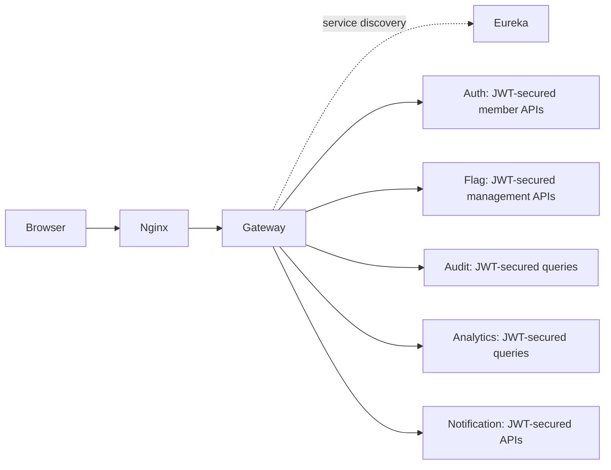
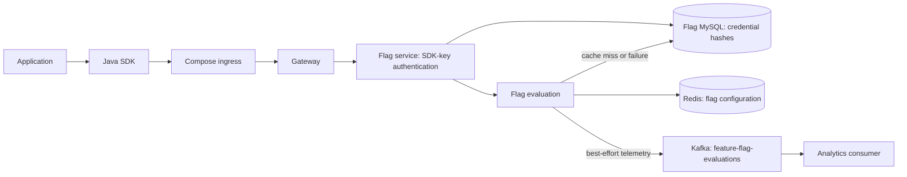
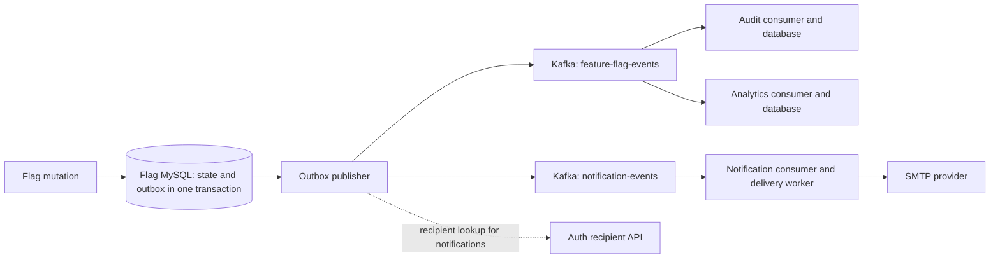

# Feature Flag Platform

A Java 21 and React platform for changing application behavior independently of a
deployment. Teams manage environment-specific flags, schedule releases, target
subjects, and expand a deterministic percentage rollout. Applications evaluate
flags through a separate SDK-key-authenticated runtime API.

The project demonstrates service boundaries, authorization, transactional event
delivery, idempotent consumers, and failure handling. It is a portfolio application,
not a claim of a production SLA, measured throughput, or customer adoption.

## Capabilities

- Manage flags in `DEV`, `QA`, `STAGING`, and `PROD`, including targeting, schedules,
  rollout percentages, and enable/disable controls.
- Invite members and manage roles and account status through a JWT-secured control
  plane. There is no public self-registration flow.
- Create and revoke environment-bound SDK keys; evaluate through a small Java SDK.
- Review paginated audit events, analytics aggregates, and notification activity.
- Persist flag lifecycle events in a transactional outbox; process asynchronous
  work with retries, idempotency checks, and visible terminal failure states.
- Correlate HTTP and Kafka activity and expose health and Prometheus-compatible
  metrics.

## Services and repository structure

The Java modules are independent Maven projects, rather than a root Maven reactor.
Spring Boot remains on **3.5.5**, Spring Cloud on **2025.0.0**, and Java on **21**.
The browser application uses React 19, TypeScript 6, and Vite 8.

| Component | Directory | Service port | Responsibility |
|---|---|---:|---|
| Frontend / Nginx | [Frontend/feature-flag-ui](Frontend/feature-flag-ui) | 8080 in container; 3000 on host by default | UI, static assets, same-origin API proxy |
| Gateway | [api-gateway/api-gateway](api-gateway/api-gateway) | 8080 | Routes to services discovered through Eureka |
| Auth | [auth-service/auth-service](auth-service/auth-service) | 8081 | Login, JWT issuance, members, invitations, recipient lookup |
| Flag | [flag-service/flag-service](flag-service/flag-service) | 8082 | Flag management, evaluation, SDK credentials, outbox |
| Audit | [audit-service/audit-service](audit-service/audit-service) | 8084 | Lifecycle audit records and queries |
| Analytics | [analytics-service/analytics-service](analytics-service/analytics-service) | 8085 | Lifecycle and evaluation counters |
| Notification | [notification-service/notification-service](notification-service/notification-service) | 8086 | Notification records and email delivery |
| Eureka | [eureka-server/eureka-server](eureka-server/eureka-server) | 8761 | Service discovery |
| Java SDK | [sdk/java-sdk](sdk/java-sdk) | — | Plain Java runtime client |

Other important paths are [docker-compose.yml](docker-compose.yml),
[docker/mysql/init](docker/mysql/init), [.env.example](.env.example), and
[.github/workflows/ci.yml](.github/workflows/ci.yml). Each stateful service owns a
separate MySQL database and database-scoped user. Compose runs those databases in
one MySQL instance; it does not imply separate database servers.

## Architecture

### Control plane



Login is a public Auth endpoint that issues a signed token. Subsequent control-plane
requests use `Authorization: Bearer ...`. The services enforce authorization;
gateway routing and browser role checks are not substitutes for it. Nginx serves
HTML navigation and API requests on the same origin, including collection paths
that are also React routes. See the [gateway routes](api-gateway/api-gateway/src/main/resources/application-docker.yml)
and [Nginx configuration](Frontend/feature-flag-ui/nginx.conf).

### Runtime plane



`GET /runtime/v1/flags/{flagKey}/evaluate?subject=...` authenticates the
`X-Feature-Flag-Key` header. The key determines the environment. This endpoint does
not require a user's JWT, and an SDK key does not grant flag-management privileges.
It returns `flagKey`, `environment`, and a boolean `enabled`.

The [runtime controller](flag-service/flag-service/src/main/java/com/featureflag/flag_service/controller/RuntimeEvaluationController.java)
and [security configuration](flag-service/flag-service/src/main/java/com/featureflag/flag_service/security/SecurityConfig.java)
define the boundary. In a local JVM setup the SDK can address the gateway directly
on port 8080; Compose clients use the Nginx ingress on the configured frontend port.

### Asynchronous lifecycle



The publisher enriches notification recipients through Auth using a dedicated
service credential. Notification does not call Auth to discover recipients. Member
invitation email follows a separate path: Auth commits the invitation, then calls
Notification's internal invitation endpoint. See [OutboxPayloadEnricher](flag-service/flag-service/src/main/java/com/featureflag/flag_service/service/OutboxPayloadEnricher.java)
and [InvitationNotificationDispatcher](auth-service/auth-service/src/main/java/com/featureflag/auth_service/service/InvitationNotificationDispatcher.java).

## Evaluation, caching, and concurrency

A flag must be enabled and within its schedule before targeting or rollout can
enable it for a subject. Explicit targets bypass the rollout percentage, but do
not bypass the flag's enabled state or schedule. Other subjects receive a stable
bucket from the environment, flag key, and subject using SHA-256; buckets below
the configured percentage are enabled.

Redis caches flag configuration for five minutes. Evaluation still computes the
subject and schedule decision on each request. A cache miss, unreadable cache
entry, or Redis failure falls back to MySQL. Mutations invalidate affected cache
entries after the database transaction commits. This is a cache-aside design, not
a strong cross-system consistency guarantee: failures or concurrent cache fills
can leave stale configuration until expiry. Paginated management queries read
through the repository. See [FlagService](flag-service/flag-service/src/main/java/com/featureflag/flag_service/service/FlagService.java).

Flag entities have a JPA `@Version` column. Conflicting concurrent persistence
updates return HTTP 409, including stale versions detected by JPA. The public
flag request/response does not implement a client-supplied version or ETag editing
protocol. Schedule fields are offset-free date-time values; deployments must use
a consistent service timezone. Audit/outbox timestamps use UTC clocks.

## Security model

Auth signs RSA JWTs using externally supplied PEM keys. Resource services validate
signature, expiry, issuer, and audience using the public key. Passwords are BCrypt
hashed. Roles are `OWNER`, `ADMIN`, `DEVELOPER`, and `VIEWER`; service rules restrict
management operations, SDK-key administration, and member changes. The initial
OWNER is provisioned through an explicitly enabled bootstrap configuration.

Invitations use random tokens with hashes stored by Auth. Raw acceptance URLs are
passed to email delivery without persisting the email body or token in Notification.
Acceptance checks invitation state and expiry and uses locking for concurrent
acceptance. Internal recipient and notification endpoints use distinct service
credentials. Do not reuse those credentials as JWTs or SDK keys.

The browser has one centralized local-storage authentication record, removes
expired/invalid sessions, synchronizes logout, and only attaches JWTs to intended
same-origin API requests. A protected-request 401 clears the session; a 403 does
not. Local storage remains readable by scripts running in the origin.

Nginx supplies CSP and security headers. Scripts are restricted to the same origin
without `unsafe-inline` or `unsafe-eval`; existing inline styles require
`style-src 'unsafe-inline'`. Access logging omits query strings, which matters for
invitation links. The build validates CSP against the generated HTML and assets.
See [auth policy](Frontend/feature-flag-ui/src/auth/authPolicy.ts),
[auth storage](Frontend/feature-flag-ui/src/auth/authStorage.ts), and
[CSP validation](Frontend/feature-flag-ui/scripts/validate-csp.mjs).

### SDK-key lifecycle

An OWNER or ADMIN creates a key with `POST /sdk-keys`, supplying a name and
environment. The random credential is returned once. The database stores its
SHA-256 hash and display prefix, plus metadata; listing keys returns metadata,
not recoverable credentials. `GET /sdk-keys` is paginated, and
`POST /sdk-keys/{id}/revoke` disables a key. Rotate by creating a replacement,
updating the consuming application's secret, and revoking the old key.

Runtime authentication checks active keys against persisted credentials. The Java
client places the credential only in `X-Feature-Flag-Key`, never in the URL.
Key administration currently uses REST; there is no dedicated SDK-key UI.
See [SdkKeyController](flag-service/flag-service/src/main/java/com/featureflag/flag_service/controller/SdkKeyController.java)
and [SdkKeyCredentialService](flag-service/flag-service/src/main/java/com/featureflag/flag_service/service/SdkKeyCredentialService.java).

### Login rate limiting

Failed login attempts are tracked per normalized account identifier using a
hashed key. Defaults are five failures in five minutes with a bounded store.
Rejected attempts return HTTP 429 with `Retry-After`; successful login resets the
account's failure state. The limiter is process-local and fails open with metrics
and a sanitized log if its store fails. It is not a distributed abuse-prevention
service. See [LoginRateLimiter](auth-service/auth-service/src/main/java/com/featureflag/auth_service/security/LoginRateLimiter.java).

## REST contracts

Lists use a zero-based `page`, a bounded `size` (default 20, maximum 100), and a
`PageResponse` containing `content`, `page`, `size`, `totalElements`, and
`totalPages`. UI list pages use previous/next controls and refresh page metadata
after mutations. Page-local filters and summaries describe the current page. The
dashboard traverses all flag pages for its totals; that traversal is not a
transactional snapshot and becomes more expensive as the dataset grows.

Application errors use Spring `ProblemDetail` and `application/problem+json`:

```json
{
  "type": "urn:feature-flag-platform:problem:validation-failed",
  "title": "Validation Failed",
  "status": 400,
  "detail": "Validation failed for one or more fields",
  "instance": "/flags",
  "code": "validation-failed",
  "timestamp": "2026-09-06T10:00:00Z",
  "correlationId": "example-correlation",
  "errors": { "flagKey": "flagKey is required" }
}
```

Validation details are bounded to 32 fields, 64 characters per field name, and
160 characters per message, and do not include rejected values. Request and
domain errors retain their meaning: 400 validation, 401 unauthenticated,
403 forbidden, 404 missing resources, 409 conflicts, and 429 login rate limiting.
Unexpected failures use sanitized 500 details. Gateway failures and internal
invitation delivery failures retain appropriate 5xx statuses. `instance` omits
query parameters. The frontend decodes messages and correlation references through
[one parser](Frontend/feature-flag-ui/src/api/errors.ts), with a fallback for
non-ProblemDetail responses from infrastructure.

## Kafka, outbox, and consumers

Flag state changes and lifecycle/notification outbox rows commit in the same MySQL
transaction. Publishing happens afterward. The outbox publisher waits for Kafka
acknowledgement, records successful delivery, and retries failures with capped
backoff. Exhausted attempts become `DEAD` outbox rows. Published rows older than
the configured retention age are removed in bounded batches; the default age is
seven days. Pending and dead rows are not removed by that retention job.

This provides at-least-once delivery, not a distributed exactly-once transaction.
A crash after Kafka acknowledgement and before recording publication can produce
a duplicate. Consumers use persisted event identifiers and database transactions
to protect their effects. See [OutboxDeliveryService](flag-service/flag-service/src/main/java/com/featureflag/flag_service/service/OutboxDeliveryService.java)
and [OutboxRetentionService](flag-service/flag-service/src/main/java/com/featureflag/flag_service/service/OutboxRetentionService.java).

| Topic | Consumer / purpose | Failure destination |
|---|---|---|
| `feature-flag-events` | Audit and Analytics, separate consumer groups | `feature-flag-events-audit-dlt` / `feature-flag-events-analytics-dlt` |
| `feature-flag-evaluations` | Analytics evaluation consumer | `feature-flag-events-analytics-dlt` |
| `notification-events` | Notification consumer | `notification-events-dlt` |

Consumer configurations use bounded retry/backoff and dead-letter publishing with
send-result checking. Correlation headers are propagated through Kafka. Dead-letter
topics and `DEAD` database rows are separate failure mechanisms; replay and
remediation require operator judgment. Compose initializes the listed topics with
one partition and one replica for local use.

Evaluation telemetry is best-effort and does not use the transactional outbox.
Publishing failures are recorded, but do not change an otherwise successful flag
evaluation. Events can be lost during sustained Kafka outages.

### Analytics

Aggregates are identified by `(flag_key, environment, event_type)` under a unique
constraint. MySQL `INSERT ... ON DUPLICATE KEY UPDATE count = count + 1` performs
the increment atomically, and `count` is non-null. Aggregate updates and the
processed-event marker participate in the same transaction. Lifecycle and
evaluation ingestion remain separate consumers. Evaluation counts distinguish
`EVALUATION_ENABLED` and `EVALUATION_DISABLED`; they are not unique-user counts.

The [repository](analytics-service/analytics-service/src/main/java/com/featureflag/analytics_service/repository/AnalyticsEventRepository.java),
[lifecycle consumer](analytics-service/analytics-service/src/main/java/com/featureflag/analytics_service/kafka/AnalyticsEventConsumer.java),
and [evaluation consumer](analytics-service/analytics-service/src/main/java/com/featureflag/analytics_service/kafka/EvaluationTelemetryConsumer.java)
implement this model. MySQL integration tests cover atomic increments, concurrent
aggregation, duplicate events, transaction rollback, and migrations.

### Audit

Flag lifecycle events include identity, environment, actor/source information,
before/after snapshots, and occurrence time. Audit stores those fields with event
idempotency and exposes paginated queries. Historical records can have null
enrichment fields. Audit records feature-flag lifecycle activity; it is not a
complete security-event or member-action audit system.

### Notification

Kafka ingestion persists notification work before delivery. Workers use durable
state, leases, claim tokens, bounded attempts, and retry scheduling. OWNER can see
all notifications; ADMIN visibility includes recipient/creator activity; other
roles see their own recipient records. Unsupported delivery types do not become
successful email sends.

Invitation emails use a separate synchronous internal endpoint so raw acceptance
URLs are not stored for background retry. That endpoint returns 502 when delivery
fails. Auth dispatches after its invitation transaction commits and logs delivery
failures safely: a successful invitation-creation response does not prove that
SMTP delivery succeeded. Administrators can resend invitations. See
[NotificationAccessPolicy](notification-service/notification-service/src/main/java/com/featureflag/notification_service/service/NotificationAccessPolicy.java)
and [notification services](notification-service/notification-service/src/main/java/com/featureflag/notification_service/service).

## Observability and schema evolution

HTTP uses `X-Correlation-ID`; a valid bounded incoming value is reused, otherwise a
new value is created by the existing correlation mechanism. Services put it in MDC
and ProblemDetail responses; outbox and Kafka processing preserve it across the
asynchronous boundary. This is correlation, not a distributed tracing deployment.

The five business services expose Actuator health, metrics, and
`/actuator/prometheus` according to profile configuration. Metrics include login,
evaluation, telemetry publishing, outbox, consumer failures, and notification
delivery. Health responses hide component details. Docker readiness for stateful
services includes the database; Redis/Kafka failure does not automatically remove
Flag from readiness, allowing fallback and outbox behavior to operate. Scrapers
need service-network access and the required authentication. No Prometheus or
Grafana server is bundled in Compose.

Flyway owns schema changes for Auth, Flag, Audit, Analytics, and Notification;
Hibernate uses schema validation rather than updating production tables. Existing
versioned migrations are preserved. Integration profiles exercise fresh and legacy
schema paths. MySQL 8.4 tests currently emit Flyway's warning that this database
version is newer than its tested support range; the pinned Flyway version has not
been overridden merely to suppress the warning.

## Run locally

### Prerequisites and configuration

- Java 21 and Maven 3.9.x for JVM builds.
- Node 24 and npm for the frontend; CI/container builds pin Node 24.18.1.
- Docker with Compose v2 for the local stack and Testcontainers suites.
- OpenSSL or another tool capable of creating an RSA PKCS#8 private PEM key and
  the corresponding public PEM key.
- SMTP credentials for actual email delivery.

Copy [.env.example](.env.example) to `.env` and fill its required values. Do not
commit `.env` or private credentials. It groups:

| Configuration | Purpose |
|---|---|
| `MYSQL_ROOT_PASSWORD`, each service's `*_DB_USERNAME` / `*_DB_PASSWORD` | Initial database/user provisioning and service connections |
| `AUTH_JWT_PRIVATE_KEY_FILE`, `JWT_PUBLIC_KEY_FILE` | Absolute host paths mounted read-only into containers |
| `JWT_ISSUER`, `JWT_AUDIENCE`, `JWT_KEY_ID`, `JWT_ACCESS_TOKEN_TTL` | JWT validation/issuance; default lifetime 15 minutes |
| `AUTH_RECIPIENTS_SERVICE_KEY` | Flag publisher → Auth recipient lookup |
| `NOTIFICATION_INTERNAL_SERVICE_KEY` | Auth → internal invitation delivery |
| `NOTIFICATION_MAIL_USERNAME`, `NOTIFICATION_MAIL_PASSWORD` | SMTP authentication |
| `FRONTEND_BASE_URL`, `FRONTEND_PORT` | Invitation-link origin and public application port |
| `BOOTSTRAP_OWNER_*` | Explicit first-run OWNER provisioning |

Use distinct database usernames, strong generated passwords, and separate internal
service credentials. MySQL initialization scripts apply to a fresh volume; editing
an environment variable is not a database credential-rotation procedure.

Example key generation, in a directory outside this repository:

```sh
openssl genpkey -algorithm RSA -pkeyopt rsa_keygen_bits:2048 -out jwt-private.pem
openssl pkey -in jwt-private.pem -pubout -out jwt-public.pem
```

Set the two `*_FILE` variables to those absolute paths. On Linux, the backend
runtime UID/GID 10001 must be able to read the mounted keys. For an empty Auth
database, enable OWNER bootstrap and provide its name/email/password for the first
startup; turn bootstrap off after provisioning the owner.

### Compose

For a configured, dedicated local environment:

```sh
docker compose config --quiet
docker compose up --build -d
docker compose ps
```

Open `http://localhost:3000` (or the configured frontend port). Compose keeps MySQL,
Redis, Eureka, and backend service ports internal. Kafka's optional host listener
binds to loopback. The public app is served by an unprivileged Nginx container;
Java runtime containers also run without root and use healthchecks.

Compose pins MySQL 8.4.11, Redis 8.10.0, and Kafka 4.3.1. It creates lifecycle,
evaluation, notification, and DLT topics with broker auto-creation disabled.
MySQL and Kafka use named volumes. Stop the application with `docker compose stop`
when preserving local state. TLS termination, backups, and external monitoring are
deployment responsibilities, not supplied production services.

### JVM and Vite development

Alternatively, provide **dedicated local** MySQL databases/users, Redis on 6379,
and Kafka on 9092 with the topic topology above. Export the service configuration
variables into each JVM's environment; Maven does not automatically load `.env`.
For local JWT resources, use `AUTH_JWT_PRIVATE_KEY_LOCATION` and
`JWT_PUBLIC_KEY_LOCATION` with `file:` resource locations instead of Compose's
host `*_FILE` variables. Set the invitation frontend origin to the Vite origin.

In IntelliJ, set `JWT_ISSUER` and `JWT_AUDIENCE` in every resource service's run
configuration, including Flag Service, to the same values used by Auth Service
(`feature-flag-auth` and `feature-flag-api` in `.env.example`). Each also needs
`JWT_PUBLIC_KEY_LOCATION` pointing to Auth's public key. Run configurations do not
inherit another service's environment variables. Flag Service rejects unresolved
JWT configuration placeholders at startup.

Start Eureka, then the service modules, then Gateway in separate terminals:

```sh
mvn -f eureka-server/eureka-server/pom.xml spring-boot:run
mvn -f auth-service/auth-service/pom.xml spring-boot:run "-Dspring-boot.run.profiles=local"
```

Use the same command pattern for Flag, Audit, Analytics, Notification, and Gateway.
Their `application-local.yml` files define local ports and connection settings.

```sh
cd Frontend/feature-flag-ui
npm ci
npm run dev
```

Vite runs on port 5173 and proxies browser API calls to Gateway on 8080. Local API
documentation is available through the configured Springdoc routes; Docker-profile
Swagger/API docs are disabled and blocked at Nginx.

## Java SDK

Build and install the plain library into your local Maven repository:

```sh
mvn -f sdk/java-sdk/pom.xml clean install
```

Coordinates are `com.featureflag:feature-flag-java-sdk:0.1.0-SNAPSHOT`. The repository
does not publish this snapshot to a public artifact registry.

```java
import com.featureflag.sdk.FeatureFlagClient;
import java.time.Duration;

FeatureFlagClient flags = FeatureFlagClient.builder()
        .baseUrl(System.getenv("FEATURE_FLAG_BASE_URL"))
        .sdkKey(System.getenv("FEATURE_FLAG_SDK_KEY"))
        .connectTimeout(Duration.ofSeconds(2))
        .requestTimeout(Duration.ofSeconds(3))
        .build();

boolean showNewCheckout = flags.isEnabled("new-checkout", "user-123", false);
```

Reuse the client across evaluations. Network failures, timeouts, non-200 responses,
and malformed/ambiguous JSON return the caller's default. Duplicate JSON fields
and trailing content are rejected; valid unknown fields and surrounding whitespace
are accepted. Invalid builder configuration or missing/blank method arguments fail
validation before a request. There is no Spring runtime dependency, streaming
connection, local flag cache, or offline evaluation mode. See the
[SDK README](sdk/java-sdk/README.md).

## Testing and CI

Ordinary suites are hermetic: use `src/test` configuration, mocks, and H2 where
appropriate. Native MySQL semantics are tested with disposable Testcontainers,
not inferred from H2 behavior. Production JARs must exclude test classes, fixtures,
test keys/profiles, H2, and Testcontainers.

Run ordinary verification per Java module from the repository root:

```sh
mvn -f auth-service/auth-service/pom.xml clean verify
mvn -f flag-service/flag-service/pom.xml clean verify
mvn -f audit-service/audit-service/pom.xml clean verify
mvn -f analytics-service/analytics-service/pom.xml clean verify
mvn -f notification-service/notification-service/pom.xml clean verify
mvn -f api-gateway/api-gateway/pom.xml clean verify
mvn -f eureka-server/eureka-server/pom.xml clean verify
mvn -f sdk/java-sdk/pom.xml clean verify
```

With Docker available, add `-Pmysql-it` for Auth, Flag, Audit, Analytics, or
Notification. Flag additionally has `-Pinfrastructure-it` for disposable
Kafka/Redis/MySQL behavior. These profiles do not require starting the persistent
Compose stack. Check failures **and skipped counts** when evaluating a run.

```sh
mvn -f analytics-service/analytics-service/pom.xml verify -Pmysql-it
mvn -f flag-service/flag-service/pom.xml verify -Pinfrastructure-it
cd Frontend/feature-flag-ui
npm test
npm run lint
npm run build
```

The frontend suite covers authentication policy, ProblemDetail decoding, and full
page traversal for dashboard totals. `build` runs TypeScript, creates production
assets, and validates CSP. Backend tests cover roles, SDK credential isolation,
error/status/correlation contracts, concurrency, retries, and domain behavior.
See the [CI workflow](.github/workflows/ci.yml) for the exact module/profile matrix
and packaged-artifact checks. It is configured to run on pushes to `main` and pull
requests; local validation is not evidence of a remote GitHub Actions run.

## Design decisions, tradeoffs, and limitations

- **Separate control and runtime credentials:** application evaluation does not
  need a human JWT or management permission. SDK-key checks still require the
  server/database; the client is intentionally small.
- **Outbox for lifecycle reliability, best-effort evaluation telemetry:** lifecycle
  changes are durable with their state mutation; per-evaluation telemetry avoids
  another durable write on every evaluation and can be lost during outages.
- **MySQL atomic counters and transaction-scoped markers:** preserve aggregate
  correctness under concurrent consumers without read-modify-write updates.
- **Independent service builds:** error contracts and security conventions have
  service-local implementations. Keeping them aligned requires coordinated tests;
  no shared platform library or generated client contracts are introduced.
- **Process-local login limiting:** limits are not coordinated across Auth replicas
  and reset on process restart. It is not a replacement for perimeter controls.
- **Stateless JWT authorization:** disabling a user blocks new login and Auth checks,
  but an already-issued JWT can remain usable on other resource services until expiry.
- **Browser token storage:** CSP reduces script exposure but does not make local
  storage equivalent to an HttpOnly-cookie session.
- **Cache consistency and schedules:** Redis provides bounded caching, not strict
  consistency; offset-free scheduling requires consistent deployment timezones.
- **Invitation delivery:** creation commits before email dispatch; successful
  creation does not guarantee receipt. Raw invitation URLs are not durable retry
  payloads, so resend is an explicit administrative operation.
- **Operational footprint:** one local MySQL instance and one Kafka broker, with no
  multi-region deployment, tenant isolation, Kubernetes, automatic DLT replay, or
  bundled monitoring/backup system. No throughput benchmark or SLA is asserted.
- **Version compatibility:** Flyway's MySQL 8.4 support warning remains even though
  the repository's disposable MySQL suites pass on the pinned image. Dependency
  analysis also reports framework/aggregator false positives; these are reviewed
  rather than used to remove reflective runtime dependencies blindly.

Kubernetes, multi-region coordination, streaming/offline SDK evaluation, external
identity providers, and broader deployment automation are possible future design
choices, not implemented features. The project does not use Keycloak, MongoDB,
RabbitMQ, or Elasticsearch.

Dependency maintenance is configured through [Dependabot](.github/dependabot.yml)
with weekly grouped updates and limited open PRs. Spring Boot/Cloud major or minor
updates and npm major updates are intentionally excluded from automatic version
PRs. No auto-merge policy is configured. Generated output, local IDE files, logs,
and environment secrets are ignored; PEM files under `src/test/resources` are test
fixtures, never deployment credentials.
